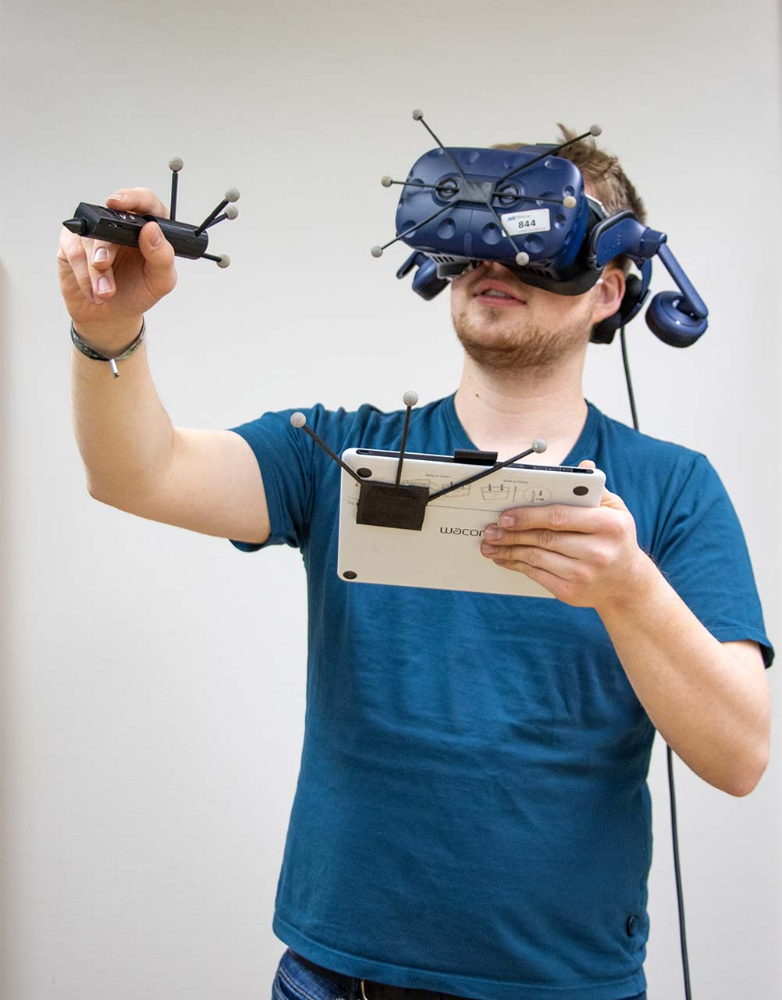

# Über mich

Ich bin Philipp und ich belege im Wintersemester 2022/2023 das Anwendungsfach Sketching with Hardware. 
Ich habe mich für dieses Fach entschieden weil ich als Kind immer Erfinder werden wollte und erhoffe mir durch das Fach die Fahigkeit anzueignen, kleine Problemstellungen selber technisch lösen zu können.

# Was ich gerne bauen würde

Wenn ich alle Fähigkeiten aus dem Kurs beherrschen, würde ich ein 3-Achsen Kameragimbal bauen. Außerdem würde ich zusätzliche Hardware einbauen, um Positions und Bewegung zusäztlich zum Kameratracking bestimmen zu können.
