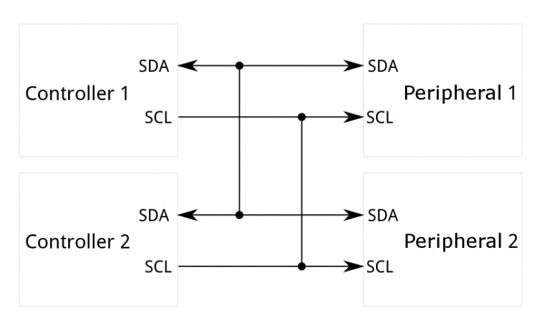
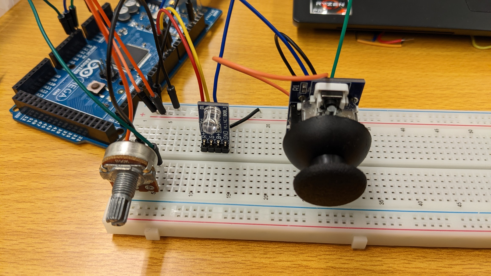
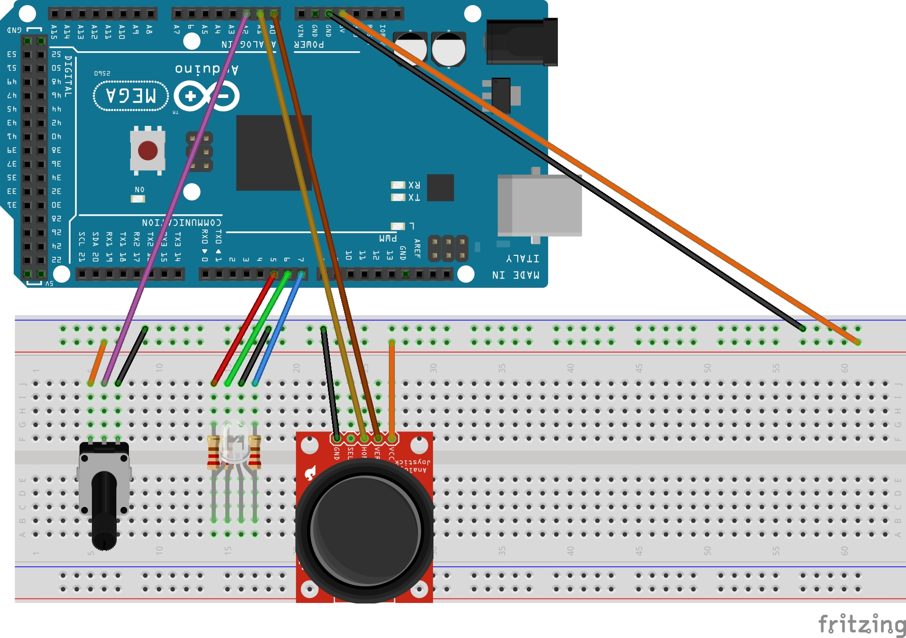

## Theorie

### Arduino

#### Hardware


 
_Aufbau eines Arduino UNO [[8]](#literatur)_

#### Software

Der Arduino wird mit C++ programmiert

##### IDE

###### Arduino IDE

Die [Arduino IDE](https://www.arduino.cc/en/software) ist eine Entwicklungsumgebung für Arduino basierte Mikrocontroller. 

###### PlatformIO

[PlatformIO](https://platformio.org/) ist eine Erweiterung für Visual Studio Code, welche die Entwicklung für Arduino basierte Mikrocontroller vereinfacht. Dies ist insbesondere für größere Projekte von Vorteil, da die IDE eine bessere Strukturierung der Projekte ermöglicht. Ebenso profitiert man von den Features und Erweiterungen von Visual Studio Code.


#### Serielle Kommunikation

#### Inter Integrate Circuit (I²C)

I²C ist ein grundlegendes Protokoll zur seriellen Kommunikation. Dieses Potokoll nutzt lediglich einen Clock- und einen Data Pin (SCL,SDA). Die Clock gibt den Takt an, in dem das gesendete Signal ausgewertet werden soll. Bei der seriellen übertragung wird, wie der Name schon vermuten lässt, alle Bit eines Bytes nacheinander gesendet. [[2]](#literatur)


_Beispiel Serieller Übertragung_ [[3]](#literatur)

Das I²C Protokoll ist für die Kommunikation zwischen periphären Integrierten Schaltungen (IC) und nur für kurze Distanzen innerhalb eines Gerätes gedacht. Trotz der nur zwei Pins ist es möglich bist zu 1008 periphäre Geräte zu verbinden. Außerdem werden mehr als 1 Controller unterstützt im Gegensatz zu z.B. SPI. I2C kommuniziert mit einer Datenrate von 100kHz bis 400kHz. Pro Byte and gesendeten Daten wird ein Meta bit zur Bestätigung gesendet (ACK/NACK). [4](#literatur)

 
_Controller - Periphal Aufteilung_ [[5]](#literatur)


##### Protokoll
Die übertragenen Nachrichten werden in zwei Arten von Frames unterteilt, die Adress Frames und die Daten Frames. Der Controller kommunieziert mit dem Adress Frame, mit welchem Peripheral er kommunizieren möchte. Die Daten Frames werden, entsprechend dem read/write bit, entweder vom Controller zum Peripheral oder vom Peripheral zum Controller gesendet.
Um den Adress Frame zu initialisieren muss der Controller den SCL Pin auf High und SDA auf low. Bei mehreren Controllern erhält derjenige die Kontrolle, welcher zuerst den SDA Pin auf low setzt. 
Eine Kommunikation beginnt immer mit dem Adress Frame. Dieser gibt mit 7 Bit den Empfänger an. Das 8. Bit gibt an, ob der Controller Daten senden oder empfangen möchte. Das 9 Bit gibt Rückmeldung, ob die Daten erfolgreich übertragen wurden oder interpretiert wurden (ACK-Low/NACK-High). Im Falle eines NACK wird die Kommunikation abgebrochen und der Controller bestimmt das weitere Vorgehen.

Danach werden die eigentlichen Daten (+ ACK/NACK) gesendet, entsprechend der Read/Write Richtung.
Nachdem alle Daten gesendet wurden wird ein Stop Zustand hergestellt, indem der SDA von Low auf High wechselt nachdem der SCL Pin auf High ist. [[4]](#literatur)


Beispielübertragung I²C Protokoll [[6]](#literatur)


## Labor

Auch wenn im obere Abschnitt die serielle Kommunikation beschrieben wird, wurde im praktischen Teil erst einmal mit den Sensoren und Aktoren experimentiert.

### Projekt: HSL Steuerung

Im Labor habe ich eine Schaltung und Steuerung gebaut, welche mittels eines Joysticks und Drehreglers eine HSV/HSL Steuerung für eine RGB LED realisiert.

Mit dem Joystick wird der Farbwert und die Sättigung bestimmt. Mit dem Drehregler wird die Helligkeit bestimmt.

Um den Hue wert zu bestimmen, wird der Joystick als Koordinatenpaar (x,y ∈ [0,512]) interpretiert und mittels Arcustangens in den Bereich von 0 bis 360 Grad umgerechnet:  
```hue = atan2(y,x)*180/π```. 

Die Sättigung wird mittels Pythagoras bestimmt:  
```sat = sqrt(x²+y²)/511.5*255```.

Die Helligkeit wird mittels des Potentiometers (z ∈ [0,512] ) bestimmt (```val = z/2;```).

Die HSV Werte werden mittels des weiter unten gezeigten Algorithmus in RGB Werte umgerechnet.


Mit hilfe der Pulsweitenmodulation  (PWM) werden die RGB Werte an die LED ausgegeben.




#### Komponenten und Bauteile

* Arduino Mega 2560
* Breadboard Typ MB-102
* [4duino SensorKit 40 in 1](https://cdn-reichelt.de/documents/datenblatt/A300/4DUINOSENSORKIT.pdf)
  * B09 RGB LED
  * B01 Joystick
  * B19 Potentiometer
* 3x 220 Ohm Widerstand
* Steckbrücken und Kabel

#### Schaltplan



#### Code

```C++
int Joy_X = A0;
int Joy_Y = A1;

int POT= A2;

int LED_R = 5;
int LED_G = 6;
int LED_B = 7;

float  x=0;
float  y=0;

void setup() {
  pinMode(LED_R,OUTPUT);
  pinMode(LED_G,OUTPUT);
  pinMode(LED_B,OUTPUT);

  Serial.begin(9600);
  Serial.println("Start");
}

void loop() {
  x = (analogRead(Joy_X)-511.5);
  y = (analogRead(Joy_Y)-511.5);

  double h = atan2(y,x);
  h = h*(180/PI)
  double s = sqrt(x*x+y*y)/511.5*255;

  int l = analogRead(POT)/2; 

  int color[3];
  HSVtoRGB(h,s,l,color);

  int r = color[0];
  int g = color[1];
  int b = color[2];

  analogWrite(LED_R,r);
  analogWrite(LED_G,g);
  analogWrite(LED_B,b);

}
// Based on https://forum.arduino.cc/t/umrechnung-hsv-nach-rgb/255462
void HSVtoRGB(int hue, int sat, int val, int colors[3]) {
 // hue: 0-359, sat: 0-255, val (lightness): 0-255
 int r, g, b, base;
 if (sat == 0) 
  {                     // Achromatic color (gray).
  colors[0] = val;
  colors[1] = val;
  colors[2] = val;
  } 
 else  
  {
  base = ((255 - sat) * val) >> 8;
  switch(hue / 60) 
   {
   case 0:
    r = val;
    g = (((val - base) * hue) / 60) + base;
    b = base;
    break;
   case 1:
    r = (((val - base) * (60 - (hue % 60))) / 60) + base;
    g = val;
    b = base;
    break;
   case 2:
    r = base;
    g = val;
    b = (((val - base) * (hue % 60)) / 60) + base;
    break;
   case 3:
    r = base;
    g = (((val - base) * (60 - (hue % 60))) / 60) + base;
    b = val;
    break;
   case 4:
    r = (((val - base) * (hue % 60)) / 60) + base;
    g = base;
    b = val;
    break;
   case 5:
    r = val;
    g = base;
    b = (((val - base) * (60 - (hue % 60))) / 60) + base;
    break;
   }
   colors[0] = r;
   colors[1] = g;
   colors[2] = b;
  }
 }
```

## Literatur

* [1] [Arduino IDE](https://www.arduino.cc/en/software)
* [2] Askari, Wieluch (2022) Sketching With Hardwar : 04 Microcontroller 
* [3] https://cdn.sparkfun.com/assets/e/5/4/2/a/50e1ccf1ce395f962b000000.png
* [4] https://learn.sparkfun.com/tutorials/i2c
* [5] https://cdn.sparkfun.com/r/600-600/assets/learn_tutorials/8/2/I2C-Block-Diagram.jpg
* [6] https://cdn.sparkfun.com/r/600-600/assets/learn_tutorials/8/2/I2C_Basic_Address_and_Data_Frames.jpg
* [8] https://blog-c7ff.kxcdn.com/blog/wp-content/uploads/2016/10/board-01.jpg